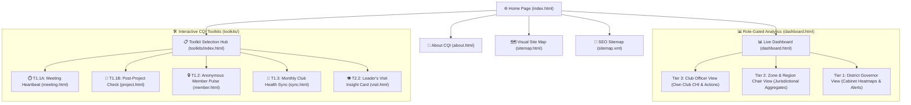

# Lions District 306 D6 — CQI Dual Mechanism Web System (2026–2027)

> **Continuous Quality Improvement (CQI) Dual Mechanism Platform**
> Official digital portal for Lion Leaders, Cabinet Officers, and Members of District 306 D6.

---

## 📌 Executive Summary

The **CQI Dual Mechanism System** is designed to transform District 306 D6 from reactive governance into a data-informed, continuous quality improvement organization. It establishes two key feedback feedback mechanisms:

1. **Mechanism 1 (M1): Internal Continuous Improvement Loop** — Micro-pulse surveys, meeting feedback, project reflections, and monthly health syncs for clubs.
2. **Mechanism 2 (M2): Leadership Oversight & Advisory Circuit** — Governor/Region/Zone Chairperson visit insights and District Cabinet analytical oversight.

---

## 🗂️ Project Structure

```
d:/Chiran/Lions/
├── website/
│   ├── index.html            # Public Landing Page (Vision, CQI Pillars, Quick Toolkit Launcher)
│   ├── about.html            # Strategy & Philosophy (Dual Mechanism explanation, PDCA Cycle)
│   ├── dashboard.html        # Tiered Analytics Dashboard (Club, Zone/Region, District Cabinet)
│   ├── sitemap.html          # Interactive Visual Site Map Page
│   ├── sitemap.xml           # Standard XML Sitemap for Search Engine SEO
│   ├── firebase-config.js    # Firebase Authentication & Firestore configuration template
│   ├── .nojekyll             # Prevents GitHub Pages Jekyll build processing
│   ├── css/
│   │   └── style.css         # Modern design system (Glassmorphism, Dark/Light Mode, CQI Palette)
│   ├── js/
│   │   ├── auth.js           # Firebase Auth & Session state management
│   │   ├── main.js           # Shared UI utilities, Toast notifications, Modal handlers
│   │   ├── mock-data.js      # District 306 D6 mock data (Clubs, Zones, Regions, Health Scores)
│   │   └── dashboard.js      # Interactive charts (Chart.js), heatmaps, and filtering logic
│   ├── assets/               # Logos and generated visual assets
│   └── toolkits/             # Interactive CQI Form Toolkits
│       ├── index.html        # Toolkit Hub & Selection Center
│       ├── meeting.html      # T1.1A: Meeting Heartbeat Form
│       ├── project.html      # T1.1B: Post-Project Reflection Form
│       ├── member.html       # T1.2: Anonymous Member Feedback Pulse
│       ├── sync.html         # T1.3: Monthly Club Health Sync Form
│       └── visit.html        # T2.2: Leader's Visit Insight Card Form
```

---

## 🗺️ System Site Map & Information Architecture



### Page & Access Hierarchy

| Route | Page Name | Access Level | Description |
| :--- | :--- | :--- | :--- |
| `/index.html` | **Home Page** | Public | District 306 D6 Vision, CQI Pillars, Real-time status, Quick toolkit launcher |
| `/about.html` | **About CQI** | Public | Philosophy, Dual Mechanism (M1/M2) strategy, PDCA cycle breakdown |
| `/sitemap.html` | **Site Map** | Public | Interactive visual map of all site links, toolkits, and role tiers |
| `/sitemap.xml` | **XML Sitemap** | Public | Web crawler index for search engine optimization (SEO) |
| `/dashboard.html` | **Analytics Dashboard** | Tier 1, 2, 3 | Dynamic Chart.js analytics, radar graphs, Club Health Index & Zone heatmaps |
| `/toolkits/index.html` | **Toolkit Hub** | Public | Portal to launch digital assessment forms |
| `/toolkits/meeting.html` | **T1.1A Meeting Heartbeat** | Club Level | 2-minute post-meeting sentiment check |
| `/toolkits/project.html` | **T1.1B Post-Project Check** | Club Level | Project ROI, community impact & team morale evaluation |
| `/toolkits/member.html` | **T1.2 Member Pulse** | Anonymous | Anonymous member feedback channel |
| `/toolkits/sync.html` | **T1.3 Club Health Sync** | Executive | Monthly executive self-assessment across 5 key pillars |
| `/toolkits/visit.html` | **T2.2 Visit Insight Card** | Leadership | Zone & Region Chairs official visit insight collector |

### Official Google Forms & Document Registry

| Toolkit / Document | Google Form / Doc Link | Embedded Web Route | Description |
| :--- | :--- | :--- | :--- |
| **Strategy & Technical Protocol** | [Google Doc Link](https://docs.google.com/document/d/1o6gt5FddKZ5tplEWJjT1c_X9ldwuvkYi4x5ZXUmqBco/edit?usp=drive_link) | `/about.html` | District 306 D6 CQI Strategy & Protocol Document |
| **Toolkit 1.1 (A)** — Meeting Heartbeat | [Google Form Link](https://docs.google.com/forms/d/1-8Sqm5CjFcr0zLfAgEKZI73rIF_5bx3f2chikvAPPYs/edit) | `/toolkits/meeting.html` | මාසික රැස්වීම් හෘද ස්පන්දන පිරික්සුම |
| **Toolkit 1.1 (B)** — Post-Project Check | [Google Form Link](https://docs.google.com/forms/d/1beJ77wFMox4ciRo8ycWH7BbJzyf6edxwdK543ei-0nU/edit) | `/toolkits/project.html` | ව්‍යාපෘති පසු-ඇගයීම් හෘද ස්පන්දන පිරික්සුම |
| **Toolkit 1.2** — Anonymous Member Pulse | [Google Form Link](https://docs.google.com/forms/d/1nbvgES1qyN3sY3cYu3wNenyOZH7MmwK9oIS2CWOoh4g/edit) | `/toolkits/member.html` | සිංහ සමාජ ගුණාත්මකතා පිරික්සුම (Solution Bank) |
| **Toolkit 1.3** — Monthly Health Sync | [Google Form Link](https://docs.google.com/forms/d/1Hb2_C9CQioMcbfnmyyQsQq7F23XYydigpAFtgATdENY/edit) | `/toolkits/sync.html` | මාසික සෞඛ්‍ය සංඥා වාර්තාව (Health Sync Form) |
| **Toolkit 2.2** — Leader's Visit Insight Card | [Google Form Link](https://docs.google.com/forms/d/1jvKzvYS_gI2SJL9dWT4-dDf2AoyylgbScXc_2O9wQE8/edit) | `/toolkits/visit.html` | නායකත්ව නිරීක්ෂණ සටහන් පත (Diagnostic Tool) |

---

## 🚀 Key Features

1. **Role-Gated 3-Tier Dashboard**:
   - **Club Level**: Tracks Club Health Index (CHI), meeting engagement, member sentiment, and action items.
   - **Zone & Region Level**: Aggregate view of clubs within Region 1-4 & Zone 1-8 to identify clubs requiring support.
   - **District Cabinet Level**: Strategic heatmaps, District-wide CQI indices, and targeted intervention triggers.

2. **Interactive Toolkit Suite**:
   - **T1.1A Meeting Heartbeat**: Quick 2-minute post-meeting sentiment check.
   - **T1.1B Post-Project Check**: Outcome evaluation, ROI, and lessons learned.
   - **T1.2 Member Pulse**: Anonymous feedback channel for members.
   - **T1.3 Monthly Health Sync**: Executive club self-assessment across 5 key pillars.
   - **T2.2 Visit Insight Card**: Zone/Region Chairs digital assessment during official club visits.

3. **Responsive Glassmorphic UI**:
   - Premium design featuring Lions International Gold & Navy Blue theme accenting.
   - Fully responsive for mobile, tablet, and desktop viewing.
   - Dynamic charts powered by Chart.js.

---

## 🔧 Setup & Local Running Instructions

The local web server is **currently active and running**:

👉 **Access Local URL**: [**http://localhost:8080**](http://localhost:8080) (or `http://127.0.0.1:8080`)

To start or restart the server manually at any time:

```powershell
cd d:\Chiran\Lions\website
python -m http.server 8080 --bind 127.0.0.1
```

Or using Node `serve`:
```bash
npx -y serve -l 8080
```

---

## 🌐 Deploying to GitHub Pages

1. Ensure all files inside `website/` are committed to your repository.
2. Go to **Repository Settings** > **Pages**.
3. Select the branch (e.g., `main`) and set the root directory or `/website` folder depending on your repo layout.
4. The `.nojekyll` file inside `website/` ensures clean routing for assets and scripts.

---

## 📄 Documentation & Strategy Files

- `CQI Dual Mechanism System – District 306 D6 (2026-2027)_ Technical Architecture & Implementation Protocol_.docx`
- `The Comprehensive CQI Strategy Presentation Deck (English).pptx`
- `​The Comprehensive CQI Strategy Report (English).pdf`
